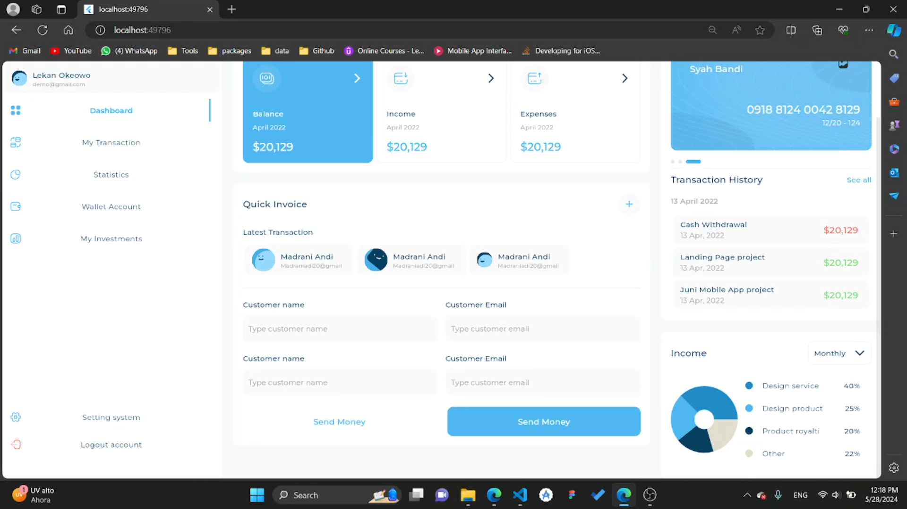

# responsive_dash_board

## description
in this project we made a responsvie and adaptive dashboard that change its size and UI acorrding to screen size and platform

1. [Installation](#installation)
2. [Usage](#usage)
3. [Images](#images)
4. [Video Demo](#video-demo)

## Installation

1. Clone the repo:
   ``` sh
    git clone https://github.com/KhaledElalfy1/responsive-dash-board
   ```
2. move to the project directory:
  ``` sh
    cd responsive_dash_board
```

3. Clean the project and install dependencies:
   ``` sh
   flutter clean
   flutter pub get
   ```

   ## Usage
   To run the project, use the following command:
   ``` sh
     flutter run
   ```

   ## Images

   1. **Mobile layout**
        
   2. **Tablet layout**
        
   3. **Desktop layout**
        


## Video demo
watch video or download it 

https://github.com/KhaledElalfy1/responsive-dash-board/assets/121667425/ef05c623-0f9f-41e5-823e-e03f15ae4658
      
